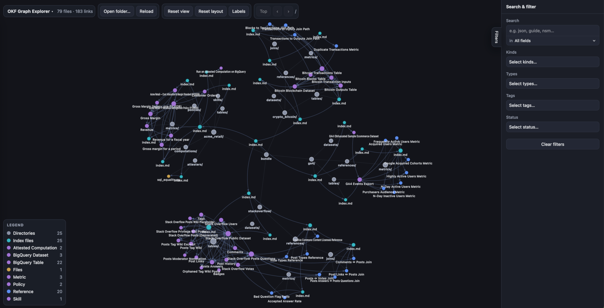

# OKF Graph Explorer

> ⚠️ Heads up: this tool was generated with AI assistance (Deepseek Flash 4.1).

> This software is currently in draft and may change.

Tool for exploring [Open Knowledge Format (OKF)](https://github.com/GoogleCloudPlatform/open-knowledge-format) bundles in your web-browser. All files are processed locally in browser.

## Demo

See https://trondolsen.github.io/okf-graph-explorer/okf-graph-explorer.html?bundle=bundles/&depth=2.

## Usage

### In local web-browser

> Note: installation is recommended in root folder of an OKF bundle.

1. Copy `okf-graph-explorer.html` to local folder.
2. Open html file in browser.
3. Select local folder to browse.

### Publish on website

> Note: bundle pages are lazily crawled so publishing is currently only recommended for small bundles.

1. Include `okf-graph-explorer.html` in website.
2. Add link to `okf-graph-explorer.html?bundle={relative-path-to-bundle}/`
3. Publish to website

### URL parameters

Optional; append to the URL and combine as needed (e.g. `?bundle=acme/&depth=1`).

| Parameter | Values | Default | Description |
| --- | --- | --- | --- |
| `bundle` | name, path, or `*.md` file | — | Bundle to load; a bare name resolves to `bundles/<name>/`. |
| `start` | file in the bundle folder | `index.md` | Crawl entry point. |
| `depth` (or `levels`) | `0`…`n`, or `all` | `all` | Link levels to prefetch; nodes with unloaded content (pages, files or attachments) show a dashed ring and load on click. |

- Bundles are discovered from `index.md` by following links (no manifest); with no parameters the tool loads `bundles/` next to the page. `bundle` and `start` must be same-origin (served from the same site).
- The crawl loads only Markdown files. Other files (non-Markdown text and binary attachments) are shown as nodes and fetched on demand when clicked.
- On `file://`, `bundle` does not auto-load — open a folder instead. `depth` also applies to locally opened folders (deeper files revealed one level at a time).
