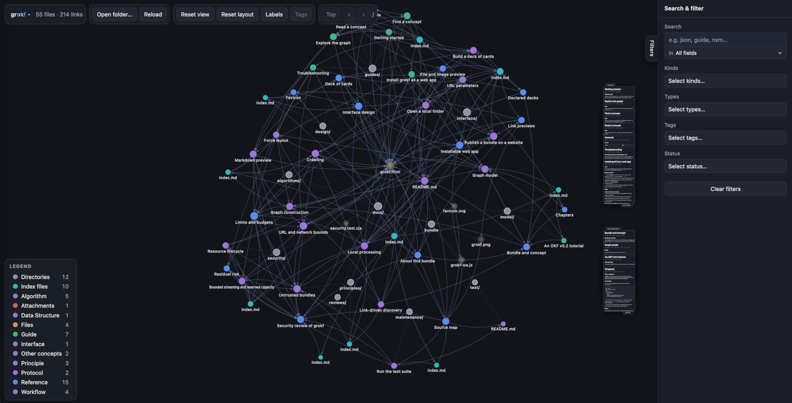

# grokf

> This software is currently in draft and may change.

> This tool was generated with AI assistance.

Tool for exploring [Open Knowledge Format (OKF)](https://github.com/GoogleCloudPlatform/open-knowledge-format) bundles in your web-browser. All files are processed locally in your web-browser.



## Usage

### Hosted on grokf.org

Visit https://grokf.org/ to try it now.

### In local web-browser

> Note: installation is recommended in root folder of an OKF bundle.

1. Copy `grokf.html` to local folder.
2. Open html file in browser.
3. Select local folder to browse.

### Publish on website

> Note: bundle pages are lazily crawled so publishing is currently only recommended for small bundles.

1. Include `grokf.html` in website.
2. Add link to `grokf.html?bundle={relative-path-to-bundle}/`
3. Publish to website

### Install as a web app

> Note: installing requires HTTPS (or `localhost`) and the companion files
> `favicons/site.webmanifest` and `grokf-sw.js`, published next to `grokf.html`.
> A copy with only `grokf.html` still runs in the browser, without installation.

1. Open the published page over HTTPS.
2. Use the browser's install command:
   - Chrome or Edge (desktop): the install icon in the address bar, or the ⋮
     menu → *Install*. grokf also shows an **Install** button once the browser
     offers installation.
   - Chrome (Android): ⋮ menu → *Install app* (or *Add to Home screen*).
   - Safari (iOS/iPadOS 16.4+): *Share* → *Add to Home Screen*.
   - Safari (macOS 14+): *File* → *Add to Dock*.
3. Launch grokf from the installed icon; it opens in its own window.

The optional `grokf-sw.js` service worker caches only the app shell, so an
installed grokf starts offline. A served bundle still needs the network; a
bundle opened from disk works offline by itself. See
[Install grokf as a web app](docs/guides/install-as-web-app.md).

### URL parameters

Optional; append to the URL and combine as needed (e.g. `?bundle=acme/&depth=1`).

| Parameter | Values | Default | Description |
| --- | --- | --- | --- |
| `bundle` | name, path, or `*.md` file | — | Bundle to load; a bare name resolves to `bundles/<name>/`. |
| `start` | file in the bundle folder | `index.md` | Crawl entry point. |
| `depth` (or `levels`) | `0`…`n`, or `all` | `all` | Link levels to prefetch; nodes with unloaded content (pages, files or attachments) show a dashed ring and load on click. |

- Bundles are discovered from `index.md` by following links (no manifest); with no parameters the tool loads `bundles/` next to the page. `bundle` and `start` must be same-origin (served from the same site).
- The crawl loads only Markdown files. Other files (non-Markdown text and binary attachments) are shown as nodes and fetched on demand when clicked.
- On `file://`, `bundle` does not auto-load — open a folder instead. `depth` also applies to locally opened folders (deeper files revealed one level at a time).

### Declared decks

A bundle can ship decks. A concept declares them in frontmatter, and the viewer
builds them when the bundle loads:

```yaml
okfx:
  decks:
    - name: Tour
      pages: [docs/guides/getting-started.md, docs/guides/explore-the-graph.md]
    - name: Model
      pages:
        - docs/model/bundle-and-concept.md
        - docs/model/graph-model.md
```

Any concept may declare `okfx.decks`; the viewer collects every declaration on
load, resolves the page paths (a bare or `/`-prefixed path from the bundle root, a
`./` or `../` path from the file, `.md` optional), and fills the deck panel. A
page that is not a loaded concept is skipped, and at most eight decks are built.
